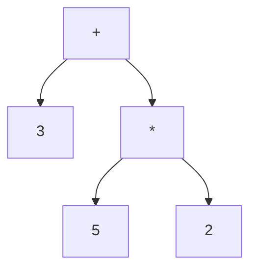

# 📘 Retos de Comprensión – Calc21

Este documento contiene las respuestas a los retos de comprensión sobre el proyecto **Calc21**, una calculadora implementada en Java con un *Lexer*, *Parser* y *Evaluator*.  

---

## 🔹 1. ¿Qué es un Token?

Un **token** es una unidad mínima de significado que el **lexer** (analizador léxico) extrae del texto fuente.  

Cada token tiene:
- **Tipo** → categoría (ejemplo: número, operador, paréntesis).  
- **Lexema** → el texto exacto que apareció en la entrada.  
- **Posición** → índice dentro de la cadena original.  

### ✨ Ejemplo con la expresión `3 + 5 * 2`

El **lexer** transforma la cadena en la siguiente lista de tokens:

```
Token(NUMBER, "3", 0)
Token(PLUS, "+", 2)
Token(NUMBER, "5", 4)
Token(STAR, "*", 6)
Token(NUMBER, "2", 8)
Token(EOF, "", 9)
```

---

## 🔹 2. Diferencia entre Lexer y Parser

### 🟢 Lexer (analizador léxico)
- Se encarga de **leer el texto carácter por carácter** y generar tokens.  
- Reconoce símbolos (`+`, `*`, `^`), números (`3.14`) o identificadores (`sin`, `cos`).  
- No entiende reglas de precedencia ni jerarquía.  

Ejemplo: convierte `3 + 5 * 2` en la lista de tokens mostrada arriba.  

### 🔵 Parser (analizador sintáctico)
- Usa esos tokens para construir un **árbol sintáctico abstracto (AST)**.  
- Aplica las reglas de la gramática (precedencia de operaciones, paréntesis, asociatividad, etc.).  

Ejemplo: a partir de `3 + 5 * 2` construye este AST:

```
     (+)
    /   \
 (3)     (*)
        /   \
      (5)   (2)
```

O con un diagrama en **Mermaid**:



---

## 🔹 3. ¿Qué significa que el parser sea recursivo?

Un parser es **recursivo** cuando sus funciones **se llaman a sí mismas** para manejar expresiones anidadas.  

### Ejemplo en el código (`power()`):

```java
private Expr power() {
    Expr base = unary();
    if (match(CARET)) {
        Expr exponent = power(); // ← llamada recursiva
        return new Binary(base, '^', exponent);
    }
    return base;
}
```

Aquí `power()` se llama a sí mismo para procesar potencias anidadas.  
Esto permite que la expresión `2 ^ 3 ^ 2` se interprete correctamente como:  

```
2 ^ (3 ^ 2)
```

y no como:

```
(2 ^ 3) ^ 2
```

### Otro ejemplo:  
Las funciones `expr() → term() → factor() → primary()` se llaman recursivamente para aplicar reglas de precedencia y paréntesis.  

---

## ✅ Resumen

- Un **Token** es la unidad léxica (ejemplo: `NUMBER "3"`).  
- El **Lexer** convierte texto en tokens.  
- El **Parser** organiza los tokens en un AST aplicando reglas gramaticales.  
- El parser es **recursivo** porque usa llamadas a sí mismo para manejar expresiones anidadas como potencias y paréntesis.  

---

# Guía de Ejemplos y Comportamiento de la Calculadora Java

Este documento explica cómo funciona la calculadora de tu proyecto Java con distintos tipos de entradas.

---

## 1. Entrada: `2 + 3 * 4`

**Paso a paso:**

1. **Lexer** convierte la cadena en tokens:

```
[NUMBER(2), PLUS(+), NUMBER(3), STAR(*), NUMBER(4), EOF]
```

2. **Parser** construye el AST respetando precedencia (`*` > `+`):

```text
Binary(
    left = NumberLit(2),
    op = '+',
    right = Binary(
        left = NumberLit(3),
        op = '*',
        right = NumberLit(4)
    )
)
```

3. **Evaluator** evalúa recursivamente:

- Subárbol derecho: `3 * 4 = 12`
- Árbol principal: `2 + 12 = 14`

**Resultado:**  

```
14.0
```

> La calculadora respeta la precedencia estándar de operadores.

---

## 2. Entrada no válida: `2 + *`

**Qué ocurre:**

1. Lexer produce tokens:

```
[NUMBER(2), PLUS(+), STAR(*), EOF]
```

2. Parser intenta construir `expr()`:

- `expr()` espera un `term()` a la derecha de `+`.
- `term()` llama a `factor()` → `power()` → `unary()` → `primary()`.
- En `primary()`, el token `*` **no es un número, paréntesis ni identificador**.

**Resultado:**  

Lanza excepción en `primary()`:

```text
Error: Token inesperado: STAR en pos 4
```

> La calculadora no se bloquea, solo informa el error de forma clara.

---

## 3. Entrada: `(2 + 3) ^ 2`

**Paso a paso:**

1. Lexer:

```
[LPAREN, NUMBER(2), PLUS, NUMBER(3), RPAREN, CARET, NUMBER(2), EOF]
```

2. Parser construye AST respetando paréntesis y asociatividad a la derecha de `^`:

```text
Binary(
    left = Binary(
        left = NumberLit(2),
        op = '+',
        right = NumberLit(3)
    ),
    op = '^',
    right = NumberLit(2)
)
```

3. Evaluator:

- Eval del subárbol: `(2 + 3) = 5`
- Eval del árbol principal: `5 ^ 2 = 25`

**Resultado:**  

```
25.0
```

> Los paréntesis se respetan correctamente y la potencia es asociativa a la derecha.

---

## Conclusión

- La calculadora respeta **precedencia de operadores** y **paréntesis**.
- Las expresiones no válidas generan errores claros sin bloquear el programa.
- Funciones (`sin`, `cos`) y operadores básicos (`+ - * / ^`) se evaluan correctamente.
